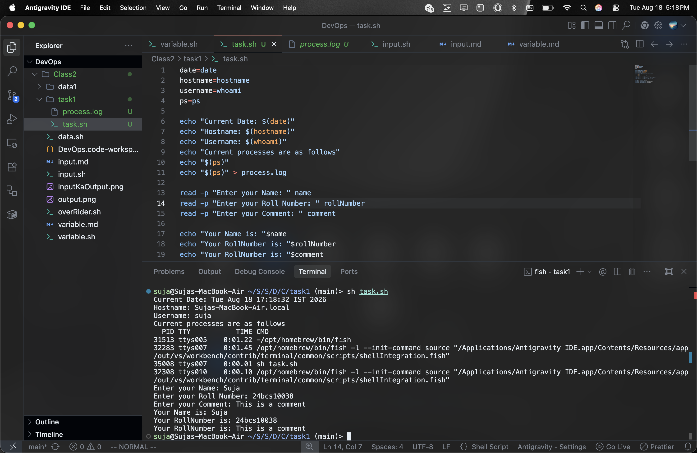

# DevOps Class 2: Task 1

This task involves writing a shell script (`task.sh`) to gather system information, interact with the user, and use output redirection.

## Script Code (`task.sh`)

```bash
date=date
hostname=hostname
username=whoami
ps=ps

echo "Current Date: $(date)"
echo "Hostname: $(hostname)"
echo "Username: $(whoami)"
echo "Current processes are as follows"
echo "$(ps)"
echo "$(ps)" > process.log

read -p "Enter your Name: " name
read -p "Enter your Roll Number: " rollNumber
read -p "Enter your Comment: " comment

echo "Your Name is: "$name
echo "Your RollNumber is: "$rollNumber
echo "Your RollNumber is: "$comment
```

## Commands Used

### System Information Commands
- **`date`**: Displays the current system date and time.
- **`hostname`**: Prints the name of the current host system.
- **`whoami`**: Prints the effective username of the current user.
- **`ps`**: Displays information about the currently active processes. 

### Input/Output and Redirection
- **`echo`**: Prints text or variable values to the terminal.
- **`read`**: Takes input from the user during script execution and assigns it to variables (e.g., `name`, `rollNumber`, `comment`).
- **`>` (Output Redirection)**: Redirects the standard output of a command to a file. For example, the script saves the output of the `ps` command into `process.log` using `echo "$(ps)" > process.log`.

### Disk Space Checking
As part of system exploration, the disk free (`df`) command was also used:
- **`df`**: Displays the amount of available disk space for file systems.
- **`df -h`**: Displays the disk space in a human-readable format (using megabytes and gigabytes).

## Script Execution Output

Below is the screenshot showing the execution of the task:

