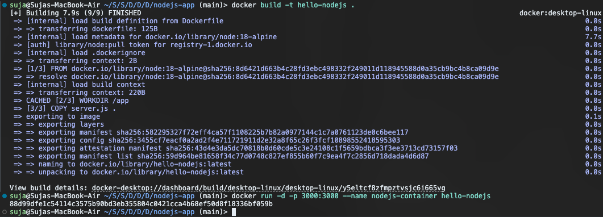
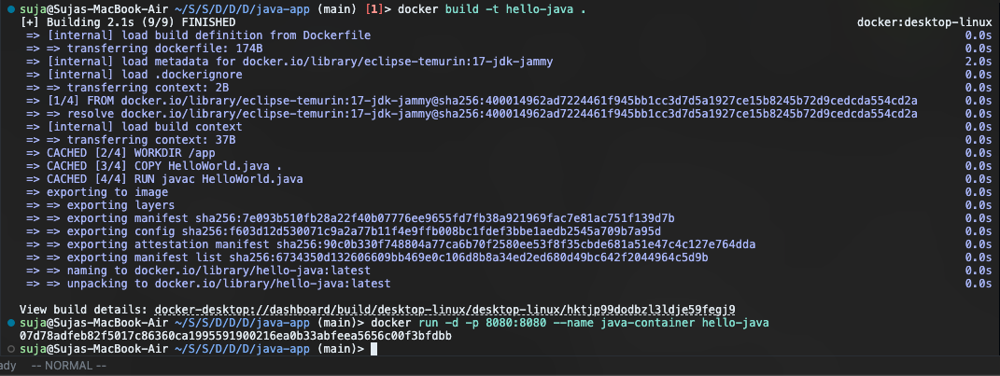
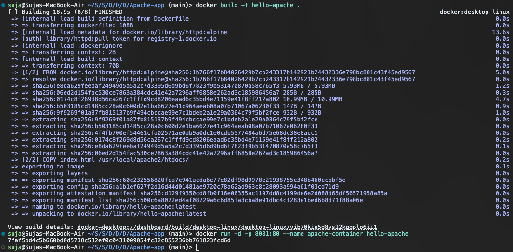
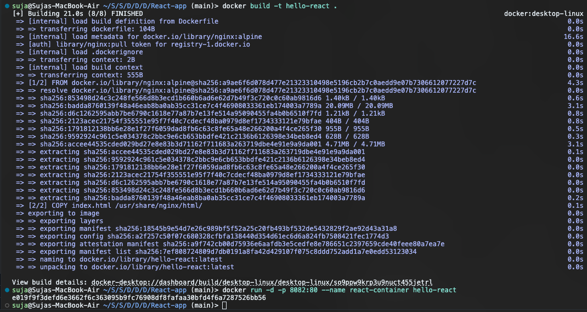
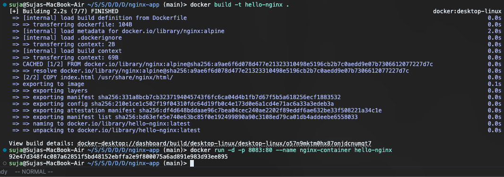

# Docker Hello World Homework

This repository contains six different "Hello World" applications, each containerized with Docker as per the homework requirements. 

Below you will find the commands used to build and run each application, along with a screenshot of the successful terminal output for each build and execution.

---

## 1. Node.js Application
A lightweight Node.js web server.

**Commands Used:**
```bash
cd nodejs-app
docker build -t hello-nodejs .
docker run -d -p 3000:3000 --name nodejs-container hello-nodejs
```

**Terminal Output:**


---

## 2. Python Application
A lightweight Python HTTP server.

**Commands Used:**
```bash
cd python-app
docker build -t hello-python .
docker run -d -p 8000:8000 --name python-container hello-python
```

**Terminal Output:**


---

## 3. Java Application
A lightweight Java web server built using `eclipse-temurin:17-jdk-jammy`. 

**Commands Used:**
```bash
cd java-app
docker build -t hello-java .
docker run -d -p 8080:8080 --name java-container hello-java
```

**Terminal Output:**
*(Note the successful multi-stage build and execution after resolving the deprecated OpenJDK image!)*


---

## 4. Apache Web Server
A standard Apache HTTP server serving a static HTML file.

**Commands Used:**
```bash
cd Apache-app
docker build -t hello-apache .
docker run -d -p 8081:80 --name apache-container hello-apache
```

**Terminal Output:**


---

## 5. React Application
A simple React application served via Nginx.

**Commands Used:**
```bash
cd React-app
docker build -t hello-react .
docker run -d -p 8082:80 --name react-container hello-react
```

**Terminal Output:**


---

## 6. Nginx Application
A standard Nginx server serving a static HTML file.

**Commands Used:**
```bash
cd nginx-app
docker build -t hello-nginx .
docker run -d -p 8083:80 --name nginx-container hello-nginx
```

**Terminal Output:**

