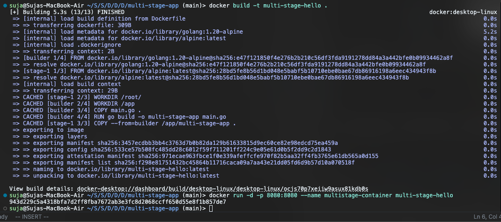
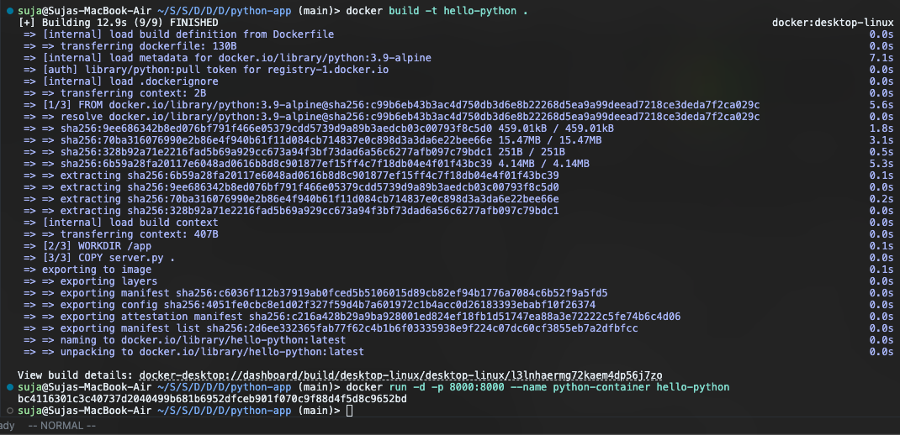

# Docker Multi-Stage Build Homework

**Name:** Shaikh Suja Rahaman
**Enrollment Number:** 24bcs10038

---

## Task 1: Run Multi-Stage Dockerfile
This folder contains a `multi-stage-app` built in Go. It uses a multi-stage `Dockerfile` to build the binary using the `golang` image and then copies the compiled binary into a tiny `alpine` image.

**Commands to run:**
```bash
cd multi-stage-app
docker build -t multi-stage-hello .
docker run -d -p 8080:8080 --name multistage-container multi-stage-hello
```

**Screenshot of application running successfully (`curl localhost:8080` or browser):**


**Screenshot of `docker ps` showing the running container on port 8080:**


---

## Task 3: Docker Application Deployment
The requirement to deploy at least 3 different types of applications has been fulfilled. I have deployed the following containerized applications.
1. **Node.js Application** (`nodejs-app`)
   
2. **Python Application** (`python-app`)
   
3. **Java Application** (`java-app`)
   
