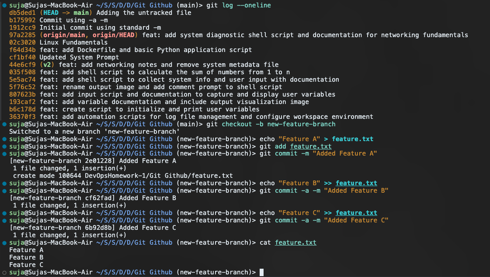
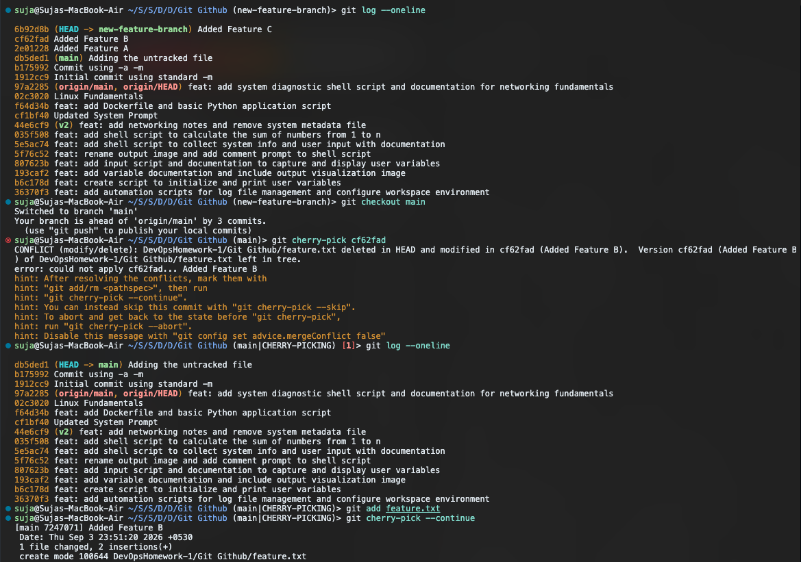

# Git and GitHub Homework

This repository contains my practice exercises for mastering Git commits and cherry-picking. 

## Task 1: `git commit -m` vs `git commit -a -m`

**The Goal:** Understand the difference between standard commits and auto-staging commits.

**Explanation:**
* `git commit -m "message"`: This is the standard way to commit. It only commits files that you have explicitly staged using `git add`.
* `git commit -a -m "message"`: The `-a` flag tells Git to automatically stage any files that have been **modified** or **deleted** before committing. However, it completely ignores brand-new (untracked) files.

**What I did:**
I created a test file and committed it normally. Then, I modified that file and created a brand-new file. When I ran `git commit -a -m`, Git successfully committed the modified file but ignored the newly created file, proving that `-a` does not track new files.

## Task 2: Git Cherry-Pick

**The Goal:** Grab a single, specific commit from a feature branch and merge it into the main branch without merging the rest of the branch.

**Explanation:**
Sometimes you work on a separate branch and make several commits, but you realize you only want to push *one* of those specific changes to your main codebase right now. `git cherry-pick <commit-hash>` allows you to copy a specific commit and apply it directly to your current branch.

**What I did:**
1. I created a new branch called `new-feature-branch`.
2. I made three distinct commits on that branch (Feature A, B, and C).
3. I switched back to my `main` branch.
4. I used `git cherry-pick` to pull *only* the "Feature B" commit into `main`.
5. I encountered a merge conflict because "Feature B" modified a file that didn't exist in `main` yet! I resolved this by manually adding the file and running `git cherry-pick --continue`.
6. Finally, I verified the single commit was successfully copied over.

**Screenshot 1: The commits on the feature branch:**

**Screenshot 2: Successfully cherry-picking Feature B into main:**

