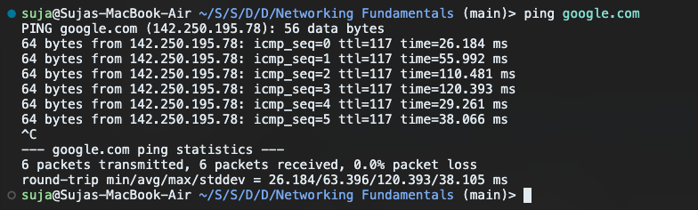
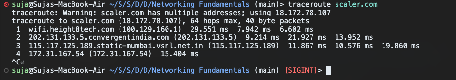
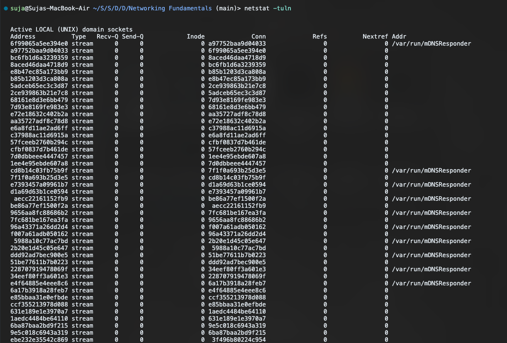
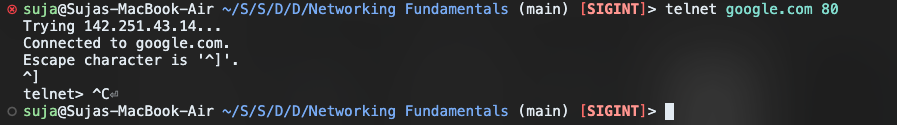
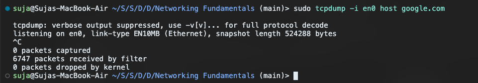
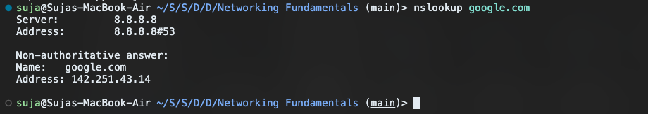
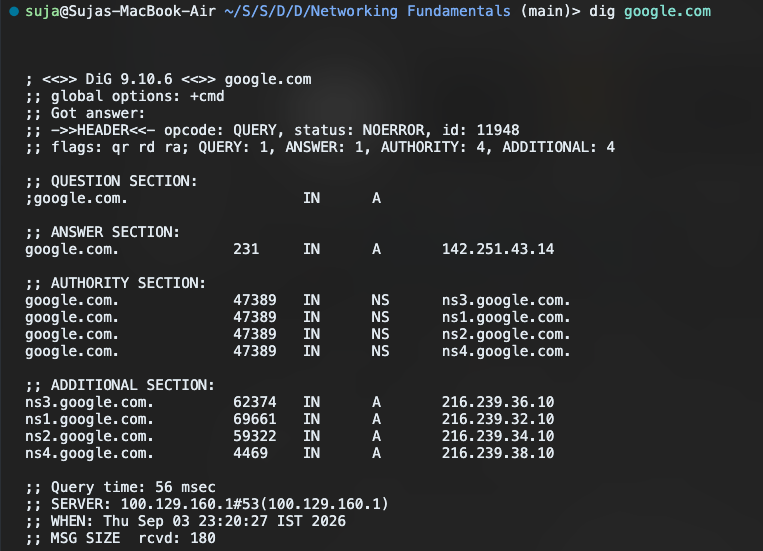
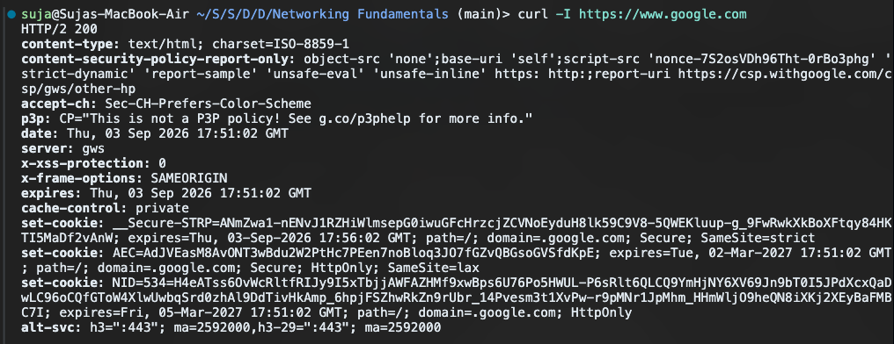
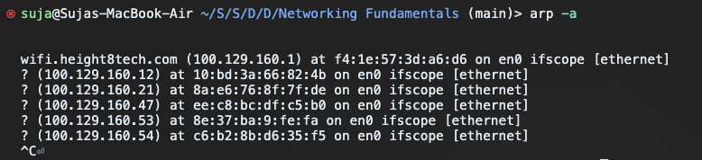
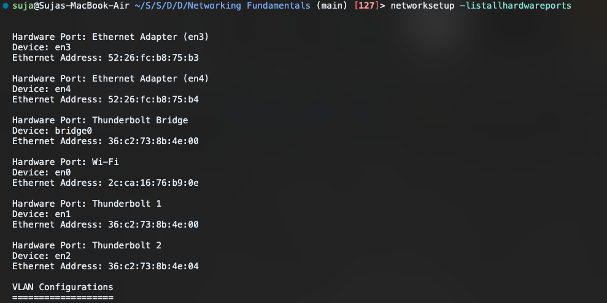

# Network Fundamentals (macOS Edition)

This guide covers ten essential networking commands to diagnose, test, and monitor network connectivity, specifically tailored for a macOS environment.

## 1. `ping`

**Why we use it:** To verify if a remote server (like Google) is online and to check how fast it responds (latency).

**Command:**
```bash
ping google.com
```

**What it does:** It continuously fires off tiny packets (ICMP echo requests) to the destination. If the server is up and allows pinging, it replies. The output tells you exactly how many milliseconds the round trip took. If you get "Request timeout," it could mean your internet is down, or the server's firewall is blocking pings.



## 2. `traceroute`

**Why we use it:** To map the exact path your data takes across the internet to reach its destination.

**Command:**
```bash
traceroute scaler.com
```

**What it does:** It reveals every single router (or "hop") your traffic bounces through before hitting Google's servers. If your internet feels slow, this command helps pinpoint exactly which hop is causing the bottleneck. If a hop shows `* * *`, that specific router simply chose not to reply, which is common for security reasons.



## 3. `netstat`

**Why we use it:** To peek at all active network connections and open ports on your local machine.

**Command:**
```bash
netstat -an
```
*(Note: On Mac, `netstat -an` or `lsof -i` are commonly used to view listening sockets, unlike Linux which uses `-tuln`)*.

**What it does:** It lists out all the TCP and UDP ports your Mac is currently using or listening on. This is super helpful if you need to figure out if an app is secretly hogging a port, or if you're verifying that a local web server actually started properly.



## 4. `telnet`

**Why we use it:** To manually test if a specific port on a server is open and accepting traffic.

**Command:**
```bash
telnet google.com 80
```

**What it does:** It attempts to establish a raw TCP connection to port 80 (HTTP) on Google's servers. If the screen goes blank or says "Connected," the port is open! If it hangs or refuses the connection, it means a firewall is blocking you, or the service on that port is offline. 



## 5. `tcpdump`

**Why we use it:** To act as a wiretap on your network interface and see all the raw traffic passing through it.

**Command:**
```bash
sudo tcpdump -i en0 host google.com
```
*(Note: Mac's primary Wi-Fi interface is usually `en0`, whereas Linux uses `eth0`)*.

**What it does:** It captures and displays the raw packets entering and leaving your Wi-Fi card (`en0`) that are communicating with Google. This is the ultimate debugging tool when you need to see if packets are actually leaving your computer, or if they are getting dropped.



## 6. `nslookup`

**Why we use it:** To ask the Domain Name System (DNS) to translate a human-readable URL into a machine-readable IP address.

**Command:**
```bash
nslookup google.com
```

**What it does:** It asks your router's DNS server to look up the IP address for google.com. If you can't reach a website, running this command proves whether or not your DNS server is functioning correctly.



## 7. `dig`

**Why we use it:** Like `nslookup`, but provides a much deeper, more detailed dive into DNS records.

**Command:**
```bash
dig google.com
```

**What it does:** It provides a comprehensive breakdown of your DNS query. It shows you the IP address (the 'A' record), exactly how long the query took, and the specific servers that hold the authoritative answers for the domain. 



## 8. `curl`

**Why we use it:** To make HTTP requests from the command line and inspect what the web server sends back.

**Command:**
```bash
curl -I https://www.google.com
```

**What it does:** The `-I` flag tells `curl` to only fetch the HTTP headers, not the actual website HTML. You will immediately see the status code (like `200 OK` or `404 Not Found`), the server type, and the cookies Google is trying to set on your machine.



## 9. `arp`

**Why we use it:** To see the local devices your Mac knows about on your immediate network.

**Command:**
```bash
arp -a
```

**What it does:** It dumps the ARP cache, which is a table mapping IP addresses (like `192.168.1.5`) to physical MAC addresses (like `a1:b2:c3:d4:e5:f6`). If you are having trouble reaching the router or another computer in your house, this proves whether your Mac actually knows their physical address.



## 10. `networksetup` (macOS alternative to `systemctl`)

**Why we use it:** To manage and inspect macOS network services and hardware. 

**Command:**
```bash
networksetup -listallhardwareports
```

**What it does:** Since Macs don't use Linux's `systemctl` or NetworkManager, we use `networksetup`. This specific command lists every physical network interface on your Mac (Wi-Fi, Bluetooth PAN, Thunderbolt) and tells you their device names (like `en0`), which is critical for running commands like `tcpdump`!


